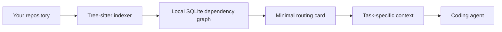

<h1 align="center">CseGraph</h1>

<p align="center">
  <strong>Give coding agents the code they need—not the whole repository.</strong>
</p>

<p align="center">
  <a href="https://github.com/RishiiShah/CseGraph/actions/workflows/ci.yml"></a>
  <a href="https://pypi.org/project/csegraph/"></a>
  <a href="https://pypi.org/project/csegraph/"></a>
  <a href="LICENSE"></a>
  <a href="https://marketplace.visualstudio.com/items?itemName=rishiishah.csegraph-vscode"></a>
  <a href="https://modelcontextprotocol.io/"></a>
</p>

<p align="center">
  <a href="#quick-start">Quick Start</a> ·
  <a href="#install">Install</a> ·
  <a href="#set-up-your-coding-agent">Agent Setup</a> ·
  <a href="#how-it-works">How It Works</a> ·
  <a href="#benchmarks">Benchmarks</a> ·
  <a href="docs/csegraph.md">CLI & MCP Reference</a>
</p>

<br>

Coding agents often spend time and tokens searching broadly, reading entire
files, and repeating lookups. CseGraph builds a local dependency graph of your
repository and returns a small, task-specific context bundle containing the
relevant code, dependencies, imports, nearby tests, and selection reasons.

## Quick Start

```bash
pipx install csegraph
cd /path/to/your/repository
csegraph install --platform codex
csegraph index
```

Replace `codex` with your coding tool, or use `--platform auto` to configure
every supported MCP client. Restart the client after installation.

Then ask your agent to use CseGraph, or query it directly:

```bash
csegraph context "explain how authentication refresh works" \
  --detail-level auto \
  --format markdown
```

The local index is stored at `.csegraph/index.db` and should not be committed.

## Install

CseGraph requires Python 3.10 or newer. The recommended installation method is
`pipx`, which makes the CLI globally available while keeping its dependencies
isolated.

### macOS

```bash
brew install pipx
pipx ensurepath
pipx install csegraph
```

Close and reopen your terminal after `pipx ensurepath`.

### Ubuntu and Debian

```bash
sudo apt update
sudo apt install pipx
pipx ensurepath
pipx install csegraph
```

### Fedora

```bash
sudo dnf install pipx
pipx ensurepath
pipx install csegraph
```

### Arch Linux

```bash
sudo pacman -S python-pipx
pipx ensurepath
pipx install csegraph
```

Close and reopen your terminal after `pipx ensurepath`.

### Windows

Install [Python 3.10 or newer](https://www.python.org/downloads/windows/), then
open PowerShell:

```powershell
py -m pip install --user pipx
py -m pipx ensurepath
py -m pipx install csegraph
```

Close and reopen PowerShell after `ensurepath`.

### Verify

```bash
csegraph --help
```

The base package includes Python, JavaScript, and TypeScript grammars. To install
additional grammars, replace `csegraph` in the install command with one of:

```bash
pipx install "csegraph[go,rust]"
pipx install "csegraph[all]"
```

To pin the current release exactly:

```bash
pipx install csegraph==1.8.0
```

## Set Up Your Coding Agent

Run the matching command from the root of the repository you want CseGraph to
index:

| Platform | Command |
|---|---|
| All supported MCP clients | `csegraph install --platform auto` |
| Codex | `csegraph install --platform codex` |
| Cursor | `csegraph install --platform cursor` |
| Claude Code | `csegraph install --platform claude-code` |
| Gemini CLI | `csegraph install --platform gemini-cli` |
| Kiro | `csegraph install --platform kiro` |
| Antigravity CLI | `csegraph install --platform antigravity-cli` |
| Antigravity IDE global config | `csegraph install --platform antigravity-ide` |
| GitHub Copilot | `csegraph install --platform copilot` |
| VS Code project files | `csegraph install --platform vscode` |

The installer configures the MCP server, writes platform-scoped agent
instructions and supported lifecycle hooks, verifies the generated `csegraph
serve --repo <repo> --platform <client>` MCP launcher, and adds generated local
files to `.gitignore`. Each client gets its own platform tag, so a Cursor MCP
call is not treated as Codex setup. Antigravity IDE writes user-global config
only when explicitly selected. Preview the changes without writing files:

On macOS, Linux, and Windows, generated MCP configs use a native absolute
`csegraph` executable path. Windows virtualenv and pipx installs are resolved
to `Scripts\csegraph.exe`, `.cmd`, or `.bat` automatically, so you should not
need to edit `.mcp.json`, `.cursor/mcp.json`, or other generated MCP files by
hand after installation. Python user installs are handled too: if `pip install
--user csegraph` places the CLI under `%APPDATA%\Python\PythonXY\Scripts` on
Windows or `~/.local/bin` on Linux, the installer can still write that absolute
launcher path even when the folder is not on your terminal `PATH`.

```bash
csegraph install --platform codex --dry-run
```

Use `--no-hooks`, `--no-instructions`, `--no-gitignore`, or `--no-verify` when
you want a narrower setup. Diagnose a platform with:

```bash
csegraph doctor --platform auto --json
csegraph doctor --platform codex --require-observed-call --json
```

`doctor --platform auto` checks every project-scoped client config and reports
which are missing, protocol-verified, or still waiting for real host use. After
installing, open that client's MCP/tools settings and enable or approve the
`csegraph` server so the six CseGraph tools are visible. A `.csegraph` index or
another client's config is not enough; Codex, Cursor, Claude Code, and the other
hosts each need their own enabled MCP entry. Agents should not query
`.csegraph/index.db` directly or use CLI context commands as a substitute for
that platform's MCP server.

## How It Works



1. `csegraph index` parses supported source files into symbols, imports, calls,
   inheritance relationships, and test links.
2. The `csegraph_minimal` MCP tool identifies the most relevant entities and
   recommends the next graph operation.
3. The `csegraph_context` MCP tool packages the smallest useful slice for the
   current task. The CLI exposes the same workflow through `csegraph context`.
4. `csegraph refresh` updates changed and deleted files without rebuilding
   everything.

For structural questions, CseGraph can inspect graph neighborhoods or find the
shortest dependency path between two symbols.

## Common Commands

```bash
# Build the initial index
csegraph index

# Refresh changed files
csegraph refresh

# Watch the repository and refresh automatically
csegraph watch

# Check index health
csegraph status --verbose

# Retrieve context for a task
csegraph context "fix auth token refresh" --target refresh_token

# Inspect callers, callees, imports, and test relationships
csegraph inspect ContextService.build_context --depth 1

# Find a dependency path
csegraph path IndexService.index ContextService.build_context

# Export an interactive graph
csegraph export --format html --output graph.html
```

See the [CLI and MCP reference](docs/csegraph.md) for every command and flag.

## Features

| Feature | What it provides |
|---|---|
| Minimal context retrieval | Task-specific code, relationships, imports, tests, and selection reasons |
| Incremental refresh | Re-indexes changed and deleted files instead of rebuilding the whole graph |
| MCP integration | Six focused tools for indexing, refreshing, routing, context, neighborhoods, and paths |
| Local-first storage | Repository indexes stay in `.csegraph/index.db` |
| Monorepo scoping | Repeatable `--include-root` options limit indexing to selected subtrees |
| Multiple profiles | `auto`, `small`, `medium`, and `large` retrieval profiles |
| Graph export | HTML, tree, JSON, GraphML, and Obsidian output |
| Editor support | MCP setup for major coding agents plus a VS Code extension |
| Public Python API | Sync and async services for custom integrations |

## Language Support

The base package includes:

- Python
- JavaScript
- TypeScript and TSX

Optional grammars include Go, Rust, Java, C, C++, Ruby, C#, Kotlin, Groovy,
Scala, PHP, Swift, Lua, Zig, PowerShell, Elixir, Objective-C, Julia, Verilog,
and Fortran.

Install selected extras such as `csegraph[go,rust]`, or use `csegraph[all]` for
every available grammar.

## MCP Tools

| Tool | Purpose |
|---|---|
| `csegraph_index` | Build a repository graph |
| `csegraph_refresh` | Refresh changed and deleted files |
| `csegraph_minimal` | Return a compact routing card and next-tool suggestions |
| `csegraph_context` | Retrieve task-specific code context |
| `csegraph_graph` | Inspect a graph neighborhood |
| `csegraph_path` | Find the shortest path between two nodes |

Agents should call `csegraph_minimal` first, follow one suggested tool, and use
`csegraph_context` for the task-specific slice.

## Benchmarks

The native MCP benchmark runs 100 architectural queries against each of 10
open-source repositories through the same stdio path used by coding agents.

| Profile | Full-corpus baseline | MCP response volume | Reduction |
|---|---:|---:|---:|
| `auto` | 4.20B proxy tokens | 14.97M proxy tokens | **280.7x** |
| `small` | 4.20B proxy tokens | 18.17M proxy tokens | **231.3x** |
| `medium` | 4.20B proxy tokens | 18.10M proxy tokens | **232.1x** |
| `large` | 4.20B proxy tokens | 18.46M proxy tokens | **227.6x** |

These figures compare graph responses with reading the complete source corpus;
results vary by repository size and query. See
[Agent Context Benchmarks](docs/benchmarks.md) for per-repository results,
latency, methodology, and limitations.

## VS Code

Install the
[CseGraph extension from the Marketplace](https://marketplace.visualstudio.com/items?itemName=rishiishah.csegraph-vscode),
then run:

```bash
csegraph install --platform vscode
```

Open the repository in VS Code and run **CseGraph: Build Index** from the
command palette. See the [extension guide](csegraph-vscode/README.md) for
commands, settings, keybindings, and troubleshooting.

## Privacy

Normal indexing, retrieval, refresh, MCP, and VS Code operations run locally.
Repository indexes are written under `.csegraph/`; registry and daemon metadata
are stored under `~/.csegraph/`.

No network request is required for normal operation. Optional embeddings can
call an OpenAI-compatible endpoint only when explicitly configured and allowed
with `CSEGRAPH_ALLOW_CLOUD_EMBEDDINGS`.

## Documentation

- [CLI, MCP, and SDK reference](docs/csegraph.md)
- [Architecture](docs/architecture.md)
- [Benchmarks](docs/benchmarks.md)
- [Contributing](CONTRIBUTING.md)
- [Support](SUPPORT.md)
- [Security](SECURITY.md)
- [Changelog](CHANGELOG.md)

## License

CseGraph is released under the [MIT License](LICENSE).
